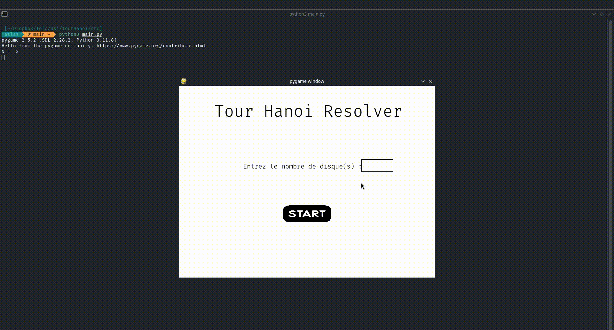

<h1> Hanoi solver </h1>

<p> A python program to solve the hanoi tower problem with N disks.  </p>

<h2> Install </h2>

```bash
git clone https://github.com/QtlasPy/NSI.git

cd TourHanoi

pip install pygame

```


<h2> Use it </h2>

```bash

python3 TourHanoi/src/main.py

```


